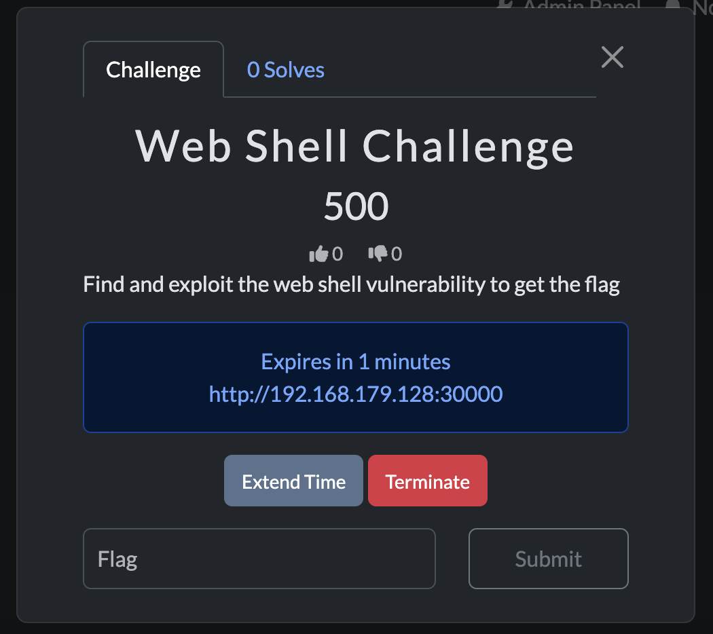
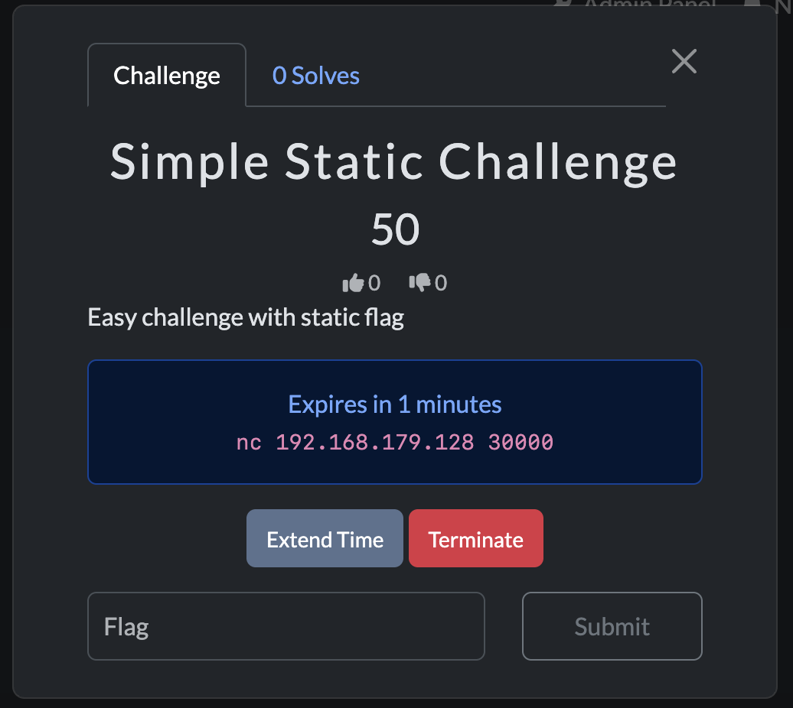

# CTFd Docker Containers Plugin

<div align="center">
  <h3 align="center">CTFd Docker Containers Plugin</h3>
  <p align="center">
    A plugin to create containerized challenges for your CTF contest.
  </p>
</div>

## Table of Contents
1. [Getting Started](#getting-started)
   - [Prerequisites](#prerequisites)
   - [Installation](#installation)
2. [Usage](#usage)
   - [Using Local Docker Daemon](#using-local-docker-daemon)
   - [Using Remote Docker via SSH](#using-remote-docker-via-ssh)
3. [ctfcli Integration](#ctfcli-integration)
   - [Creating Challenges with ctfcli](#creating-challenges-with-ctfcli)
   - [Challenge Template Structure](#challenge-template-structure)
   - [Deploying Challenges](#deploying-challenges)
4. [Demo](#demo)
5. [Roadmap](#roadmap)
6. [License](#license)
7. [Contact](#contact)

---

> [!WARNING]
> The current cheating-detection algorithm is very slow, so it is NOT recommended for competitions with many participants.

## Getting Started

This section provides instructions for setting up the project locally.

### Prerequisites

To use this plugin, you should have:
- Experience hosting CTFd with Docker
- Basic knowledge of Docker
- SSH access to remote servers (if using remote Docker)

### Installation

1. **Clone page CTFd repository:**
   ```bash
   git clone https://github.com/CTFd/CTFd.git
   cd CTFd/
   ```
2. **Add this repo as a submodule plugin:**
   ```bash
   git submodule add git@github.com:phannhat17/CTFd-Docker-Plugin.git CTFd/plugins/containers
   ```
3. **Update Python requirements:**
   ```bash
   cat CTFd/plugins/containers/requirements.txt >> requirements.in
   ```

[Back to top](#ctfd-docker-containers-plugin)

---

## Usage

### Using Local Docker Daemon

#### Case A: **CTFd Running Directly on Host:**
  - Go to the plugin settings page: `/containers/settings`
  - Fill in all fields except the `Base URL`.

  

#### Case B: **CTFd Running via Docker:**
  - Map the Docker socket into the CTFd container by modify the `docker-compose.yml` file:
  ```bash
  services:
    ctfd:
      ...
      volumes:
        - /var/run/docker.sock:/var/run/docker.sock
      ...
  ```
  - Restart CTFd
  - Go to the plugin settings page: `/containers/settings`
  - Fill in all fields except the `Base URL`.

### Using Remote Docker via SSH

For remote Docker, the CTFd host must have SSH access to the remote server.

#### Prerequisites:
- **SSH access** from the CTFd host to the Docker server
- The remote server's fingerprint should be in the `known_hosts` file
- SSH key files (`id_rsa`) and an SSH config file should be available

#### Case A: **CTFd Running via Docker**

1. **Prepare SSH Config:**
   ```bash
   mkdir ssh_config
   cp ~/.ssh/id_rsa ~/.ssh/known_hosts ~/.ssh/config ssh_config/
   ```

2. **Mount SSH Config into the CTFd container:**
   ```yaml
   services:
     ctfd:
       ...
       volumes:
         - ./ssh_config:/root/.ssh:ro
       ...
   ```

3. **Restart CTFd:**
   ```bash
   docker-compose down
   docker-compose up -d
   ```

#### Case B: **CTFd Running Directly on Host**

1. **Ensure SSH Access:**
   - Test the connection:
     ```bash
     ssh user@remote-server
     ```

2. **Configure Docker Base URL:**
   - In the CTFd plugin settings page (`/containers/settings`), set:
     ```
     Base URL: ssh://user@remote-server
     ```

3. **Restart CTFd:**
   ```bash
   sudo systemctl restart ctfd
   ```

[Back to top](#ctfd-docker-containers-plugin)

---

## ctfcli Integration

This plugin now supports [ctfcli](https://github.com/CTFd/ctfcli), the official command-line tool for managing CTFd challenges. With ctfcli integration, you can:

- Create Docker challenges from templates
- Manage challenge configuration with YAML files
- Deploy challenges to CTFd via the command line
- Version control your challenges with Git

### Creating Challenges with ctfcli

#### 1. Install ctfcli

```bash
pip install ctfcli
```

#### 2. Initialize your CTF project

```bash
ctf init
# Follow the prompts to configure your CTFd instance
```

#### 3. Create a new Docker challenge

Using the included template:

```bash
# Method 1: Copy the template manually
cp -r /path/to/CTFd-Docker-Plugin/ctfcli-template/docker/default ./challenges/my-challenge
cd challenges/my-challenge

# Method 2: Use ctfcli with custom template path (if supported)
ctf challenge add --templates /path/to/CTFd-Docker-Plugin/ctfcli-template
ctf challenge new docker
```

#### 4. Customize your challenge

Edit the `challenge.yml` file:

```yaml
name: "My Docker Challenge"
author: "Your Name"
category: "Pwn"
description: "Challenge description here"
type: container  # REQUIRED: Must be "container" for this plugin

extra:
  # Docker configuration
  image: "your-dockerhub-username/challenge-name:latest"
  port: 1337
  connection_type: "tcp"  # Options: tcp, http, https, ssh

  # Optional: Dynamic scoring
  initial: 500
  minimum: 100
  decay: 75

  # Optional: Dynamic flags
  flag_mode: "random"
  random_flag_length: 32
```

#### 5. Build your Docker image

```bash
# Use the provided build script
./build.sh

# Or build manually
docker build -t your-username/challenge-name:latest .
docker push your-username/challenge-name:latest
```

#### 6. Deploy to CTFd

```bash
# Install the challenge
ctf challenge install

# Or sync if already installed
ctf challenge sync
```

### Challenge Template Structure

The ctfcli template is located in `ctfcli-template/docker/default/` and includes:

```
docker/default/
├── challenge.yml       # Challenge configuration (REQUIRED)
├── Dockerfile          # Docker image definition
├── build.sh           # Build script
├── flag.txt           # Flag file
├── src/               # Source code
│   └── challenge.c    # Example challenge
├── dist/              # Distributable files
├── solution/          # Solution scripts
│   └── exploit.py     # Example exploit
└── README.md          # Template documentation
```

### Challenge Configuration Options

#### Required Fields

- `name`: Challenge name
- `type`: Must be `container`
- `extra.image`: Docker image name
- `extra.port`: Container port to expose
- `extra.connection_type`: Connection type (`tcp`, `http`, `https`, `ssh`)

#### Optional Fields

- `extra.command`: Override container CMD
- `extra.volumes`: Volume mounts (comma-separated)
- `extra.ssh_username`: SSH username (if using SSH)
- `extra.ssh_password`: SSH password (if using SSH)
- `extra.initial`: Initial points (dynamic scoring)
- `extra.minimum`: Minimum points (dynamic scoring)
- `extra.decay`: Decay rate (dynamic scoring)
- `extra.flag_mode`: Flag generation mode (`static` or `random`)
- `extra.random_flag_length`: Length of random flags
- `extra.flag_prefix`: Prefix for generated flags
- `extra.flag_suffix`: Suffix for generated flags

### Connection Types

#### TCP (for pwn challenges)
```yaml
extra:
  port: 1337
  connection_type: "tcp"
```
Players connect with: `nc <host> <port>`

#### HTTP/HTTPS (for web challenges)
```yaml
extra:
  port: 80
  connection_type: "http"
```
Players access via: `http://<host>:<port>`

#### SSH (for SSH challenges)
```yaml
extra:
  port: 22
  connection_type: "ssh"
  ssh_username: "ctfplayer"
  ssh_password: "password123"
```
Players connect with: `ssh ctfplayer@<host> -p <port>`

### Deploying Challenges

```bash
# Install a single challenge
cd challenges/my-challenge
ctf challenge install

# Install all challenges
ctf challenge install --all

# Sync changes to an existing challenge
ctf challenge sync

# Verify challenge status
ctf challenge verify
```

### Example Workflow

```bash
# 1. Create challenge from template
cp -r ctfcli-template/docker/default ./challenges/buffer-overflow
cd challenges/buffer-overflow

# 2. Customize the challenge
vim src/challenge.c
vim challenge.yml

# 3. Build the Docker image
./build.sh

# 4. Test locally
docker run -p 1337:1337 buffer-overflow:latest
nc localhost 1337

# 5. Deploy to CTFd
ctf challenge install

# 6. Update and sync
vim challenge.yml
ctf challenge sync
```

For more detailed information, see the [template README](ctfcli-template/docker/default/README.md).

[Back to top](#ctfd-docker-containers-plugin)

---

## Demo

### Admin Dashboard
- Manage running containers
- Filter by challenge or player


### Challenge View

**Web Access** | **TCP Access**
:-------------:|:-------------:
 | 

### Live Demo


[Back to top](#ctfd-docker-containers-plugin)

---

## Roadmap

- [x] Support for user mode
- [x] Admin dashboard with team/user filtering
- [x] Compatibility with the core-beta theme
- [x] Monitor share flag 
- [ ] Monitor detail on share flag 
- [ ] Prevent container creation on solved challenge

For more features and known issues, check the [open issues](https://github.com/phannhat17/CTFd-Docker-Plugin/issues).

[Back to top](#ctfd-docker-containers-plugin)

---

## License

Distributed under the MIT License. See `LICENSE.txt` for details.

> This plugin is an upgrade of [andyjsmith's plugin](https://github.com/andyjsmith/CTFd-Docker-Plugin) with additional features.

If there are licensing concerns, please reach out via email (contact below).

[Back to top](#ctfd-docker-containers-plugin)

---

## Contact

**Phan Nhat**  
- **Discord:** ftpotato  
- **Email:** contact@phannhat.id.vn  
- **Project Link:** [CTFd Docker Plugin](https://github.com/phannhat17/CTFd-Docker-Plugin)

[Back to top](#ctfd-docker-containers-plugin)

