# CTFd Docker Container Challenge Plugin

A comprehensive CTFd plugin that enables dynamic Docker container challenges with advanced features including anti-cheat detection, automatic flag generation, dynamic scoring, and bulk import capabilities.

## Features

### Container Management
- **Dynamic Container Spawning**: Each team/user gets their own isolated Docker container
- **Automatic Lifecycle Management**: Containers auto-expire after configurable timeout
- **Resource Control**: Global limits for CPU, memory, and process count
- **Port Management**: Automatic port allocation and mapping
- **Custom Naming**: Containers named as `challengename_accountid` for easy identification
- **Subdomain routing**: Generate subdomain for each WEB challenge. Read more [here](./SUBDOMAIN_INFO.md)


### Anti-Cheat System
- **Flag Reuse Detection**: Automatically detects when teams share flags
- **Instant Ban**: Both flag owner and submitter get banned immediately
- **Audit Logging**: Complete trail of all container and flag activities
- **Cheat Dashboard**: Admin view of all detected cheating attempts

### Scoring Options
- **Standard Scoring**: Fixed points per challenge
- **Dynamic Scoring**: Points decay as more teams solve
  - Linear decay: `value = initial - (decay × solves)`
  - Logarithmic decay: Parabolic curve with minimum floor

### Flag Generation
- **Static Flags**: Same flag for all teams (e.g., `CTF{static_flag}`)
- **Random Flags**: Unique per-team flags with pattern (e.g., `CTF{this_is_the_flag_<ran_8>}` -> `CTF{this_is_the_flag_xxxxxxxx}`)
- **Automatic Preview**: Real-time flag pattern preview during challenge creation

### Bulk Import
- **CSV Import**: Import multiple challenges at once
- **Format Validation**: Automatic parsing and error reporting
- **Progress Tracking**: Real-time feedback during import

### Performance
- **Redis-Based Expiration**: Precise container killing (0-second accuracy)
- **Efficient Port Management**: Thread-safe port allocation
- **Database Optimization**: Indexed queries for fast lookups

## Installation

1. **Download the latest release:**

Download the latest release from [here](https://github.com/phannhat17/CTFd-Docker-Plugin/releases/latest) and extract it to the `plugins` directory of your CTFd installation.

Remember to rename the extracted folder to `containers`.

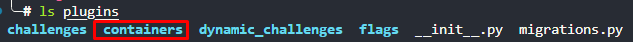

2. **Configure Docker socket access:** (Only for local docker)
```yaml
# In docker-compose.yml
  ctfd:
    volumes:
      - /var/run/docker.sock:/var/run/docker.sock
```

3. **Enable Redis keyspace notifications:**
```yaml
# In docker-compose.yml
   cache:
      command: redis-server --notify-keyspace-events Ex --appendonly yes
```

## Security Considerations

### ⚠️ CRITICAL: Cookie Theft Prevention - Reported by [j0r1an](https://jorianwoltjer.com/)

**DO NOT host challenges on the same domain as your CTFd platform.**

#### Vulnerable Configuration ❌
```
CTFd Platform:        ctf.example.com
Challenge Containers: ctf.example.com:30000, ctf.example.com:30001, etc.
```

**Why this is dangerous:**
- Browsers send cookies to ALL ports on the same domain
- If any challenge has an RCE vulnerability, attacker controls that port
- Attacker can steal CTFd session cookies from victims who visit the malicious challenge
- Result: Complete account takeover via session hijacking

#### Secure Configuration ✅
```
CTFd Platform:        ctf.example.com
Challenge Containers: challenges.example.com:30000  (separate subdomain)
                      OR 203.0.113.10:30000         (separate IP)
                      OR challenges-ctf.org:30000   (separate domain)
```

**Why this is secure:**
- Cookies are NOT shared between different domains/subdomains
- Even with RCE, attacker cannot access CTFd session cookies
- Users remain protected from session hijacking

### 🛡️ Container Network Isolation (Hybrid Strategy)

This plugin implements a **Hybrid Network Isolation** strategy to balance security and functionality:

1.  **Host:Port Challenges (Web/TCP)**:
    *   **Network**: `ctfd-isolated`
    *   **Isolation**: **Strict** (`com.docker.network.bridge.enable_icc=false`)
    *   **Effect**: Containers are isolated at Layer 2. They cannot communicate with each other (no ping, no connect). They can still access the internet via the gateway.

2.  **Subdomain Routing (Only affect Web Challenges)**:
    *   **Network**: `ctfd-challenges` (or configured value)
    *   **Isolation**: **Standard** (`enable_icc=true`)
    *   **Effect**: Web challenge containers share a network to allow the Traefik reverse proxy to route traffic. Sibling isolation is *not* enforced at the Docker network level (Traefik requirement).

3.  **Infrastructure Protection**:
    *   The CTFd main container is NOT attached to `ctfd-isolated`.
    *   It generally should not be attached to `ctfd-challenges` either (except for specific specialized setups, but `internal` network is preferred for DB access).
    *   Challenge containers cannot access the CTFd database or Redis directly.
    
## Configuration

Access admin panel: **Admin → Plugin → Containers → Settings**

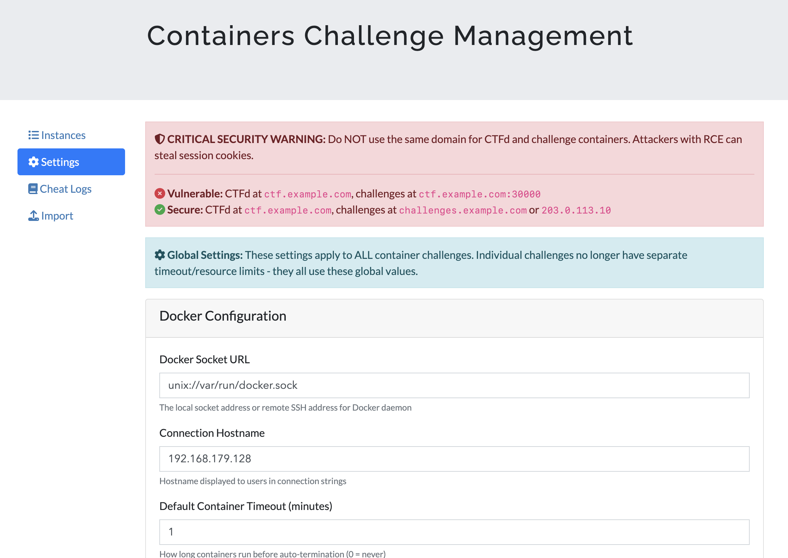

### Global Settings
- **Docker Connection Type**: 
   - Local Docker: Auto connect with `unix://var/run/docker.sock` (must be add volumes at step 1 on Installation section)
   - Remote SSH: set hostname, port, user, key and add the target server public key to know hosts file  
   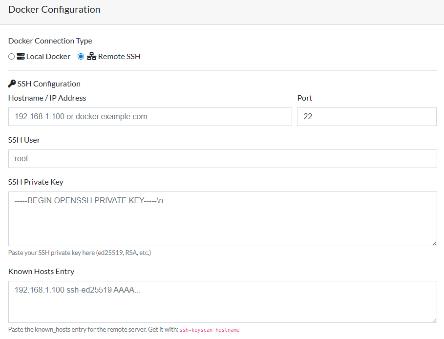
- **Connection Hostname**: **CRITICAL - Set to separate domain/IP** (see Security above)
- **Container Timeout**: Minutes before auto-expiration (default: 60)
- **Max Renewals**: How many times users can extend (default: 3)
- **Port Range**: Starting port for container mapping (default: 30000)
- **Resource Limits**:
  - Memory: Default `512m`
  - CPU: Default `0.5` cores
  - PIDs: Default `100` processes

## Creating Challenges

### Via Admin UI
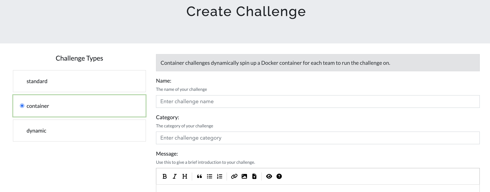

1. **Go to:** Admin → Challenges → Create Challenge → Container
2. **Fill in basic info:**
   - Name, Category, Description
   - State (visible/hidden)

3. **Configure Docker:**
   - **Image**: Docker image with tag (e.g., `nginx:latest`, `ubuntu:20.04`)
   - **Internal Port**: Port exposed inside container
   - **Command**: Optional startup command
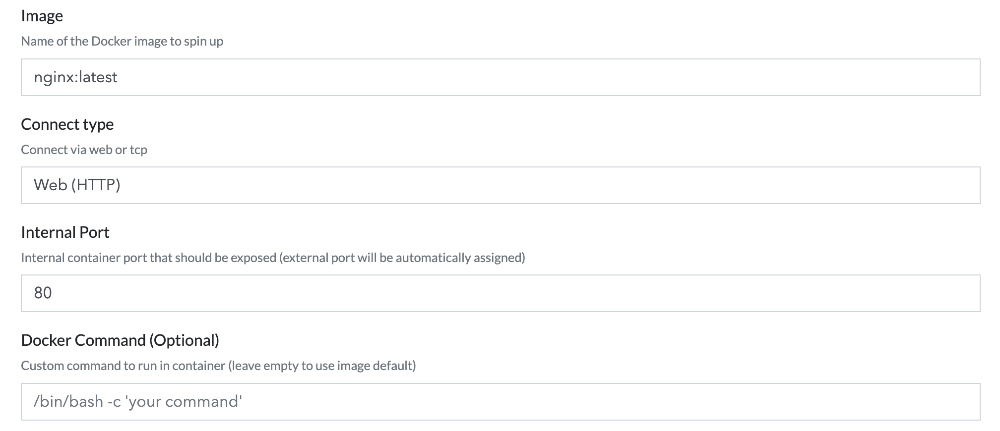

4. **Set Flag Pattern:**
   - Static: `CTF{my_static_flag}`
   - Random: `CTF{prefix_<ran_16>_suffix}`: `<ran_N>` generates N random characters
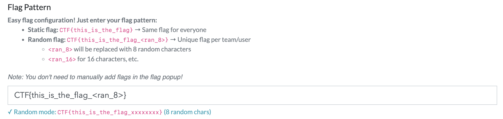

5. **Choose Scoring:**
   - **Standard**: Fixed points
   - **Dynamic**: Initial value, decay rate, minimum value, decay function
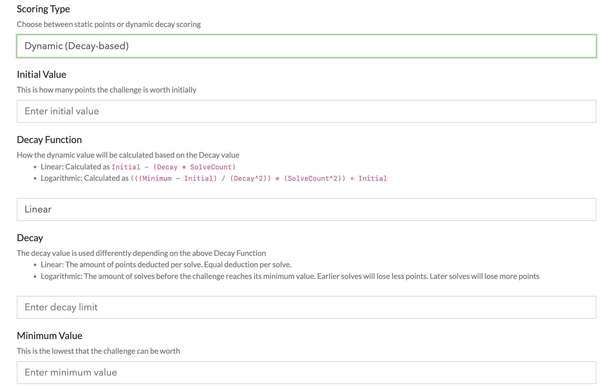

### Via CSV Import

1. **Go to:** Admin → Containers → Import

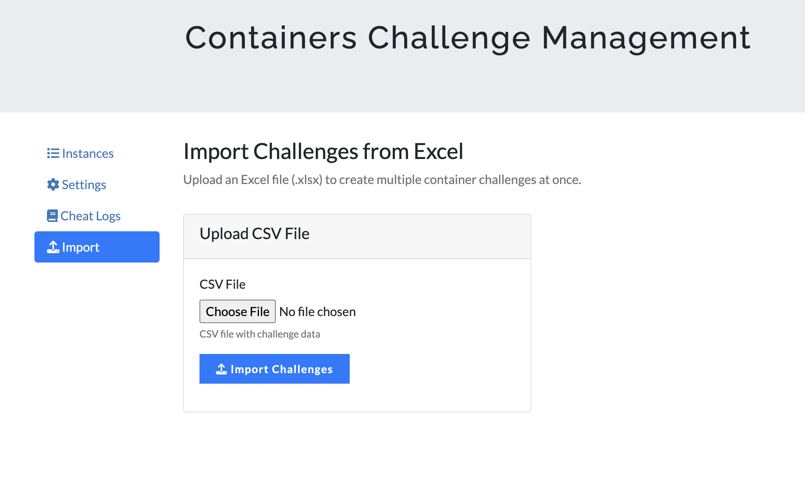

2. **Prepare CSV file** with these columns:

#### Example CSV

```csv
name,category,description,image,internal_port,command,connection_type,connection_info,flag_pattern,scoring_type,value,initial,decay,minimum,decay_function,state
Web Challenge,Web,Find the flag in web app,nginx:latest,80,,http,Access via browser,CTF{web_<ran_8>},dynamic,,500,25,100,logarithmic,visible
Simple Challenge,Misc,Easy one,alpine:latest,22,,tcp,Just connect,CTF{static_flag},standard,50,,,,standard,visible
```

**⚠️ IMPORTANT:** Docker image MUST include version tag (`:latest`, `:20.04`, etc.)

3. **Upload CSV** and wait for import to complete
4. **Check results**: Success/error messages will be displayed

## User Experience

### Requesting Container

1. User clicks **"Fetch Instance"** button on challenge page

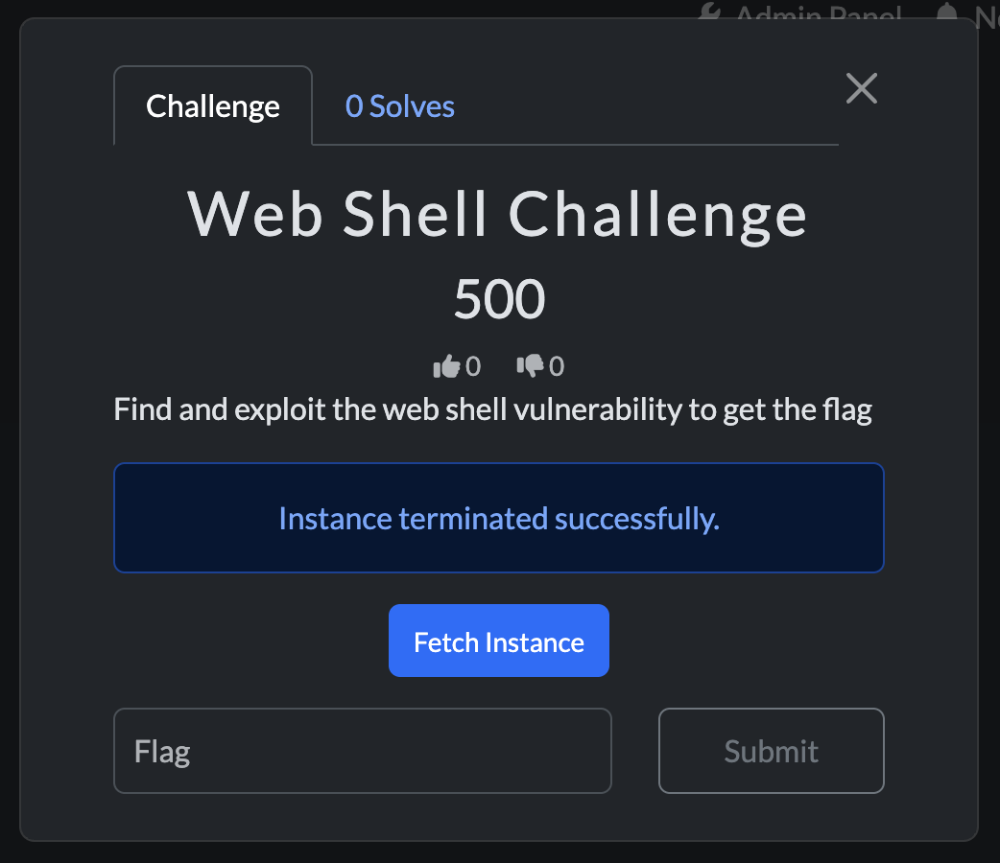

2. Container spawns within seconds
3. Connection info displayed:
   - HTTP: Browser link
   - TCP: `nc host port`


### Container Lifecycle

- **Initial Timeout**: Set by admin (default: 60 minutes)
- **Extend**: Users can extend +5 minutes (up to max renewals limit)
- **Auto-Expire**: Container killed exactly at expiration time
- **Auto-Stop**: Container killed when flag submitted correctly

### Flag Submission

- **Static Flags**: Same for all teams
- **Random Flags**: Unique per team, auto-generated
- **Anti-Cheat**: Reusing another team's flag = instant ban

## Admin Dashboard

Access: **Admin → Containers → Instances**

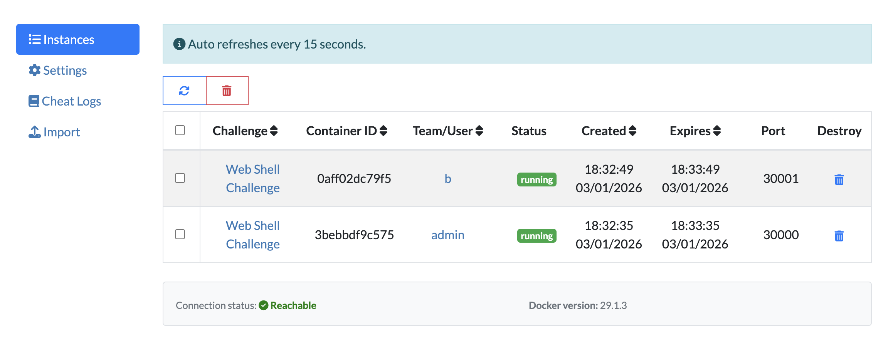

### Features
- **Real-time Status**: Running containers
- **Auto-Reload**: Dashboard refreshes every 15 seconds
- **Manual Refresh**: Button to force immediate update
- **Container Info**:
  - Challenge name
  - Team/User (clickable links)
  - Connection port
  - Expiry countdown
  - Actions (stop, delete)

### Cheat Detection

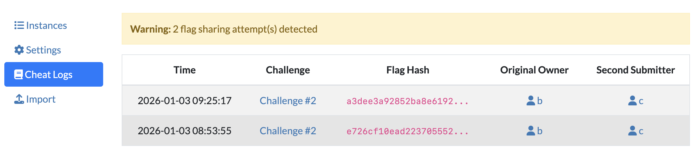

Access: **Admin → Containers → Cheat Logs**

Shows all detected flag-sharing attempts with:
- Timestamp
- Challenge name
- Flag hash
- Original owner
- Second submitter
- Automatic ban status

## Roadmap

- [x] Support multiple port mapping per image  
- [x] Discord webhook notifications
- [ ] Support docker compose file for challenge creation

## License

See LICENSE file.

