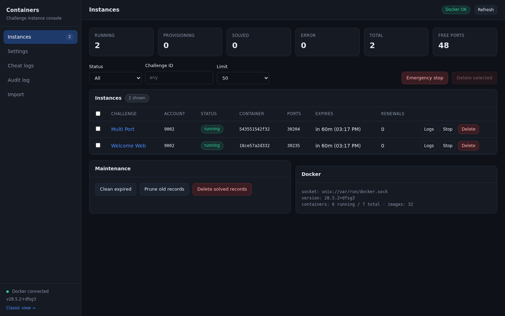

# CTFd Docker Containers Plugin

A CTFd plugin that gives every team (or every user) their own Docker container for a challenge. A player clicks **Fetch Instance**, a container starts, and the connection details appear on the challenge page. Containers expire on their own, and the plugin keeps an audit trail of everything that happens.

## Features

- One container per account per challenge, started on demand
- Automatic expiry with exact timing through Redis, plus a 30 second sweep as a backup
- A unique flag per container, encrypted at rest, or a shared static flag if you prefer
- Optional dynamic scoring with linear or logarithmic decay
- Multiple internal ports per challenge, with one link per port
- Subdomain routing through Traefik for web challenges
- Detection of flag sharing, logged and alerted, with optional auto-ban
- Admin console for instances, settings, cheat logs, the audit trail, and CSV or Excel import

## Requirements

- CTFd 3.4 or newer, tested against 3.7.7
- Docker on the CTFd host, or reachable over SSH
- Redis is optional, but recommended for exact expiry timing

## Quick start

1. Put this repository in `CTFd/plugins/containers` and mount the Docker socket into the CTFd container.
2. Install the plugin dependencies. They are not part of the stock CTFd image, and a bind mount does not install them automatically, so build the image with the Dockerfile in `docker/`.
3. Start Redis with `--notify-keyspace-events Ex` for second accurate expiry.
4. Open **Admin, Containers, Console**, then **Settings**, and set **Connection hostname** to an address your players can reach. It must not be the CTFd hostname.
5. Create a challenge of type **container**, then click **Fetch Instance** on it to verify.

Full instructions are in [this link](https://ctfd-docker-plugin.phannhat.com/).

## Security warning

Browsers send cookies to every port on a hostname. If challenge containers are published on the same hostname as CTFd, a challenge with a remote code execution bug can steal player session cookies. Use a separate hostname or IP for challenges. See [docs/security.md](docs/security.md).

## Credits

This plugin started as a fork of [andyjsmith/CTFd-Docker-Plugin](https://github.com/andyjsmith/CTFd-Docker-Plugin), which is MIT licensed. Large parts have since been rewritten, but the original structure and the challenge type come from that project, so its copyright notice is kept in [LICENSE](LICENSE) alongside this fork's own.

## License

MIT. See [LICENSE](LICENSE).

## Star History

<a href="https://www.star-history.com/?repos=phannhat17%2Fctfd-docker-plugin&type=date&logscale=&legend=bottom-right">
 <picture>
   <source media="(prefers-color-scheme: dark)" srcset="https://api.star-history.com/chart?repos=phannhat17/ctfd-docker-plugin&type=date&theme=dark&logscale&legend=bottom-right" />
   <source media="(prefers-color-scheme: light)" srcset="https://api.star-history.com/chart?repos=phannhat17/ctfd-docker-plugin&type=date&logscale&legend=bottom-right" />
   
 </picture>
</a>
