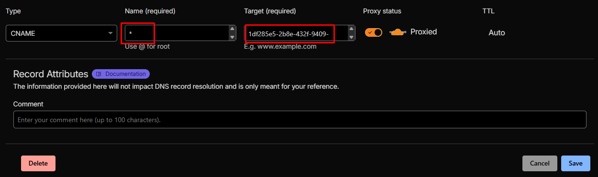
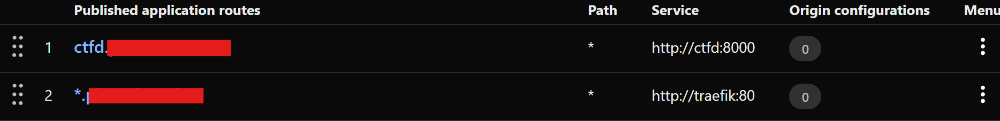
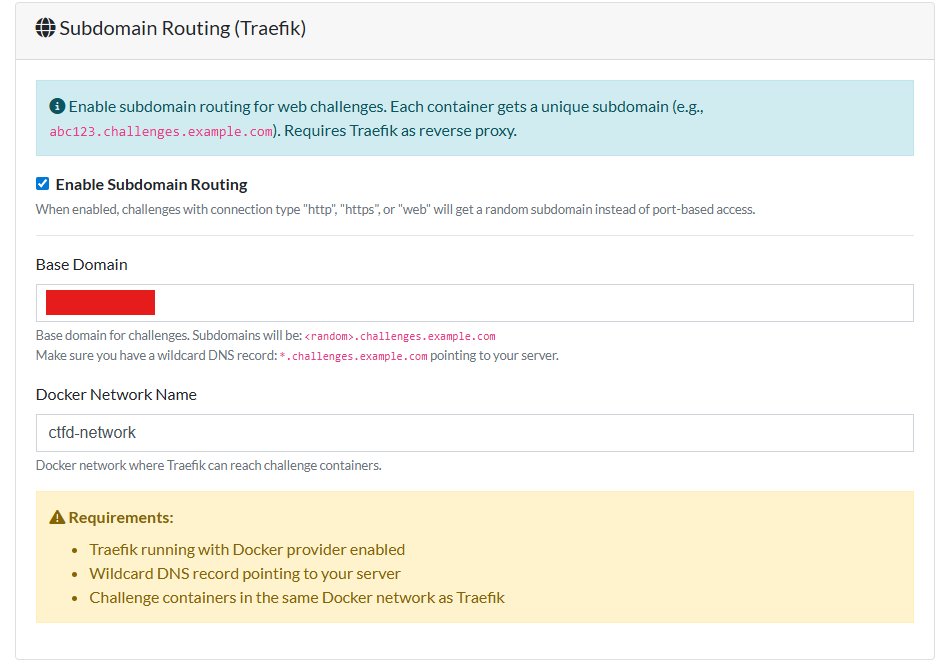
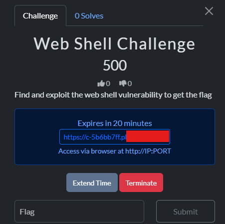
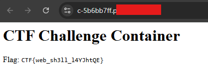

# Subdomain Routing Guide for CTFd Containers Plugin

## 1. Architecture Overview

Traditionally, container challenges are accessed via `HOST:PORT` (e.g., `ctf.example.com:30001`). Subdomain routing allows access via unique URLs (e.g., `https://c-a1b2c3d4.ctf.example.com`) without exposing ports on the host server.

> [!NOTE]
> **Why this architecture?**
> This setup uses **Cloudflare Tunnel** + **Traefik** instead of simple port forwarding or direct Nginx to **HIDE the Real Server IP**. 
> If exposing the real IP were acceptable, this could be much simpler. However, to protect the infrastructure from DDoS and direct attacks, we route all traffic through Cloudflare's Edge Network.

**Traffic Flow:**
1.  **User** visits `https://c-a1b2c3d4.example.com`
2.  **Cloudflare DNS** resolves to Cloudflare Tunnel.
3.  **Cloudflare Tunnel** forwards traffic to the `traefik` container.
4.  **Traefik** reads the Host header (`c-a1b2c3d4.example.com`), looks up the active Docker container with the matching UUID label, and routes the request to that container's internal port.

It is crucial to understand that the **CTFd Plugin does NOT route traffic**. It only "tags" containers. The routing infrastructure (Traefik + Cloudflare) does the rest.

### Components & Roles

| Component | Role | Description |
| :--- | :--- | :--- |
| **CTFd Plugin** | **Tagging** | Generates a subdomain (e.g., `c-abc12345`) and attaches Docker labels to the challenge container. Tell Docker: *"This container owns c-abc12345"*. |
| **Traefik** | **Routing** | The "Traffic Cop". It listens to Docker events. When it sees a container with the label `traefik.http.routers...`, it dynamically creates a route for it. |
| **Cloudflared** | **Ingress** | The "Tunnel". It safely exposes Traefik (port 80) to the public internet via Cloudflare Edge. |


## 2. Components

*   **Cloudflare Tunnel (`cloudflared`)**: Exposes the local Traefik service to the internet without opening ports on your router/firewall. Handles SSL termination.
*   **Traefik**: A modern reverse proxy that listens to Docker events. It automatically reconfigures routing rules when a challenge container starts or stops.
*   **CTFd Plugin**: Generates random subdomains and assigns specific Traefik labels to Docker containers when they are created.

## 3. Configuration Steps

### Step 1: Docker Compose Setup

The setup depends on where your challenges run:

#### Scenario A: Local (All-in-One)
If CTFd and challenges run on the **same server**:
1.  Example compose file: [docker-compose.samehost.yml](./docker-compose.samehost.yml).
2.  Ensure `traefik` and `ctfd` share the `ctfd-network`.
3.  **Settings**: Traefik and Cloudflared must be running in this compose file.

#### Scenario B: Remote (SSH)
If CTFd runs on Server A, but challenges run on **Server B**:
1.  **Server A (CTFd)**: Does NOT need Traefik/Cloudflared for challenges (only for itself if needed).
2.  **Server B (Challenges)**: MUST run `traefik` and `cloudflared`.
    *   Example compose file: [docker-compose.remote.yml](./docker-compose.remote.yml).
    *   Create a `docker-compose.yml` on Server B with ONLY `traefik` and `cloudflared`.
    *   **Network**: Must enable `ctfd-network` so Traefik can see containers spawned by the plugin.
    *   **Settings**: Plugin communicates via SSH, but Traefik routes locally on Server B.

*   **Traefik Version** (Both cases): Use `v2.11` (stable).
*   **Docker API** (Both cases): Set `DOCKER_API_VERSION=1.45` environment variable for Traefik to work with modern Docker Engines (v25+).
*   **Network**: All services (`ctfd`, `traefik`, challenge containers) must share a Docker network (e.g., `ctfd-network`).

### Step 2: Cloudflare Setup (Critical)

1.  **DNS Record**:
    *   Go to Cloudflare Dashboard -> DNS.
    *   Create a **CNAME** record:
        *   **Name**: `*` (Wildcard) - *Required for Cloudflare Free SSL to work*
        *   **Target**: Your Tunnel URL (e.g., `uuid.cfargotunnel.com`) or your server domain if managing tunnel differently.
        *   **Proxy Status**: On (Orange Cloud).
    
    

2.  **Tunnel Configuration** (Zero Trust Dashboard):
    *   Add a Public Hostname route:
        *   **Public Hostname**: `*.example.com` (Wildcard)
        *   **Service**: `http://traefik:80`
    *   *Note: This tells Cloudflare to send ANY subdomain request for your domain to the Traefik container.*

    

### Step 3: Plugin Settings (CTFd Admin)

Go to **Admin Panel -> Containers -> Settings**:

1.  **Enable Subdomain Routing**: Checked.
2.  **Base Domain**: Enter your root domain (e.g., `example.com`).
    *   *Do not include `challenge.` prefix if using Cloudflare Free plan (SSL limitations).*
3.  **Docker Network Name**: `ctfd-network` (Must match the network name in `docker-compose.yml`).



## 4. How It Works Internally

When a user starts a web challenge:
1.  Plugin generates a UUID (e.g., `ac3fdbd9`).
2.  Plugin formats subdomain: `c-ac3fdbd9`.
3.  Plugin creates a Docker container with labels:
    ```yaml
    traefik.enable: "true"
    traefik.http.routers.r1.rule: "Host(`c-ac3fdbd9.example.com`)"
    ```
4.  Traefik detects the new container and creates a route.
5.  Plugin returns the URL `https://c-ac3fdbd9.example.com` to the user.




## 5. Troubleshooting

### 404 Page Not Found (from Cloudflare)
*   **Cause**: DNS record missing.
*   **Fix**: Create `*` CNAME record in Cloudflare DNS.

### 404 Page Not Found (from Traefik)
*   **Cause**: Traefik is running but cannot see the container or the route.
*   **Fix**: 
    *   Check if Traefik sees Docker: `docker logs ctfd-traefik-1`. Look for API version errors.
    *   Check container labels: `docker inspect <container_id>`.

### SSL Handshake Failure / Privacy Error
*   **Cause**: Using multi-level subdomain (e.g., `abc.challenge.domain.com`) on Cloudflare Free Plan.
*   **Fix**: Switch to single-level format (`c-abc.domain.com`) by updating Plugin Settings "Base Domain" to root domain.

### Docker API Error ("client version is too old")
*   **Cause**: Mismatch between Traefik's default API version and Host Docker Engine.
*   **Fix**: Add `DOCKER_API_VERSION=1.45` (or higher) to Traefik environment variables in `docker-compose.yml`.

### Settings Not Saving
*   **Cause**: Frontend-Backend communication issue with unchecked checkboxes.
*   **Fix**: Already patched in `assets/view.js` and template. Clear browser cache.
