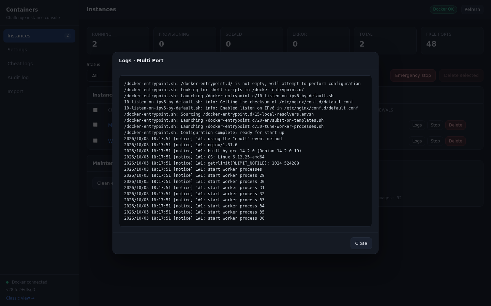
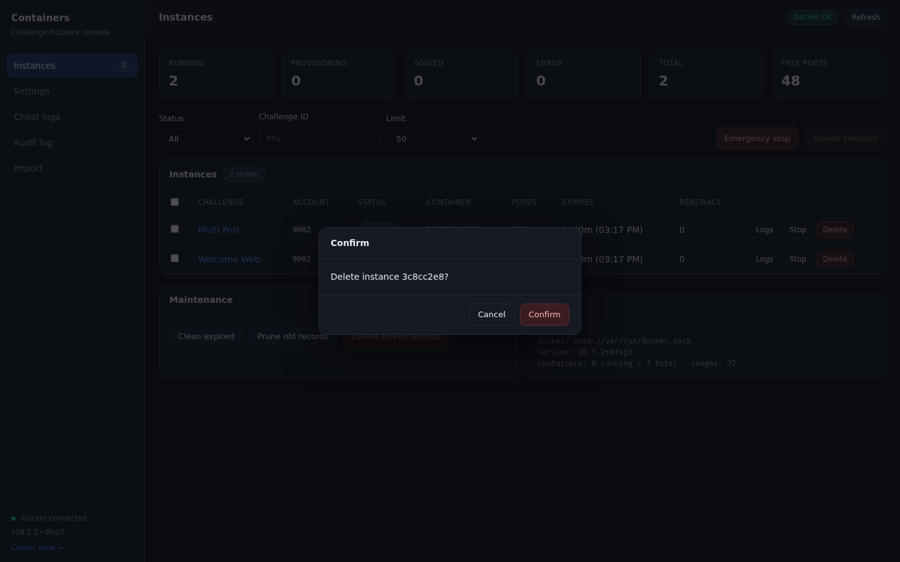
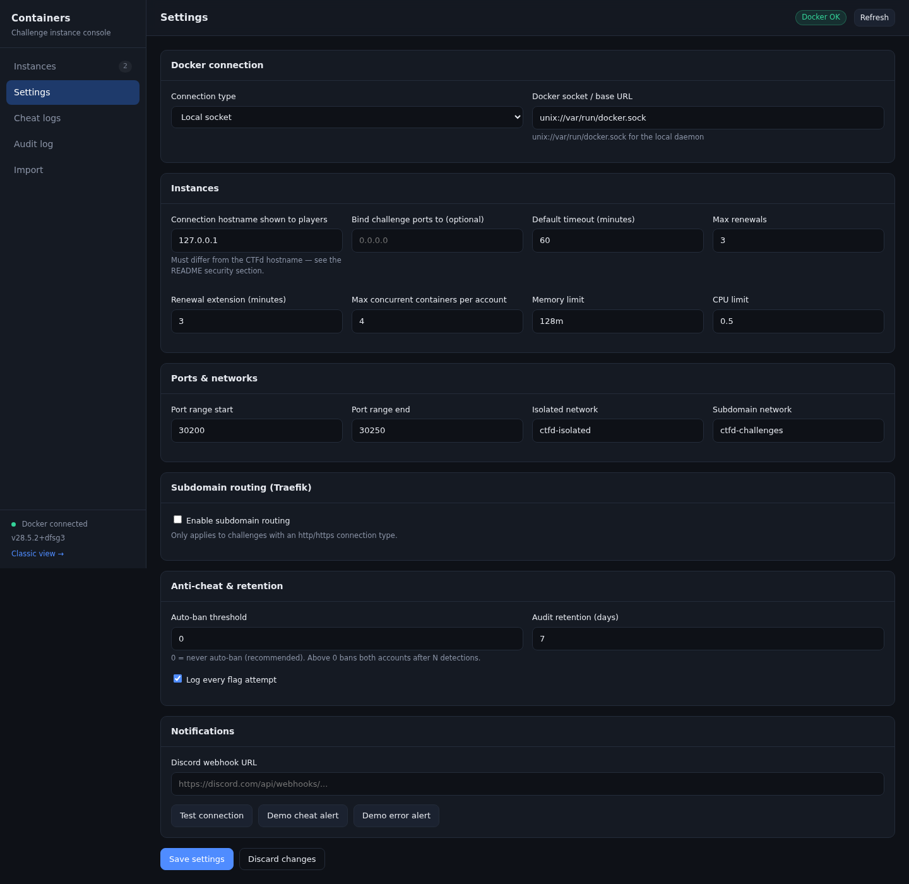
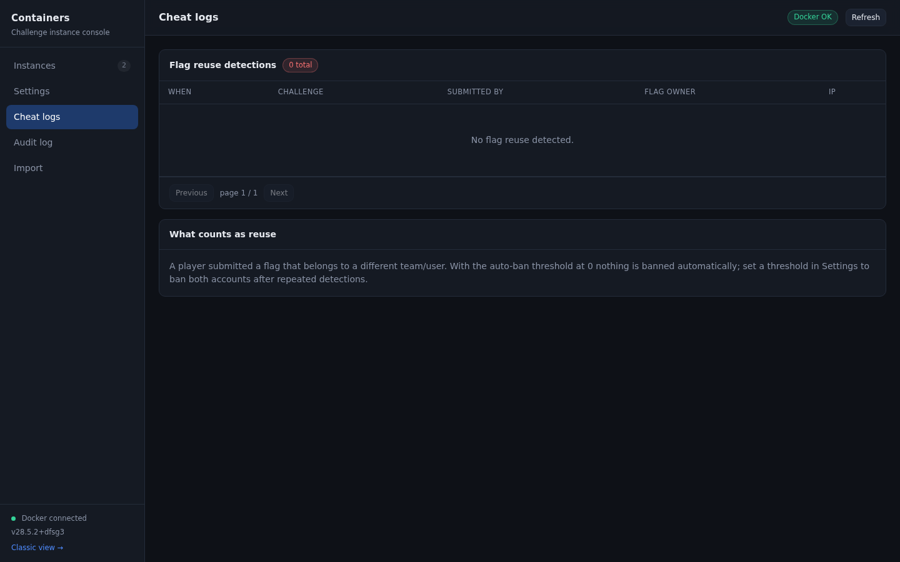
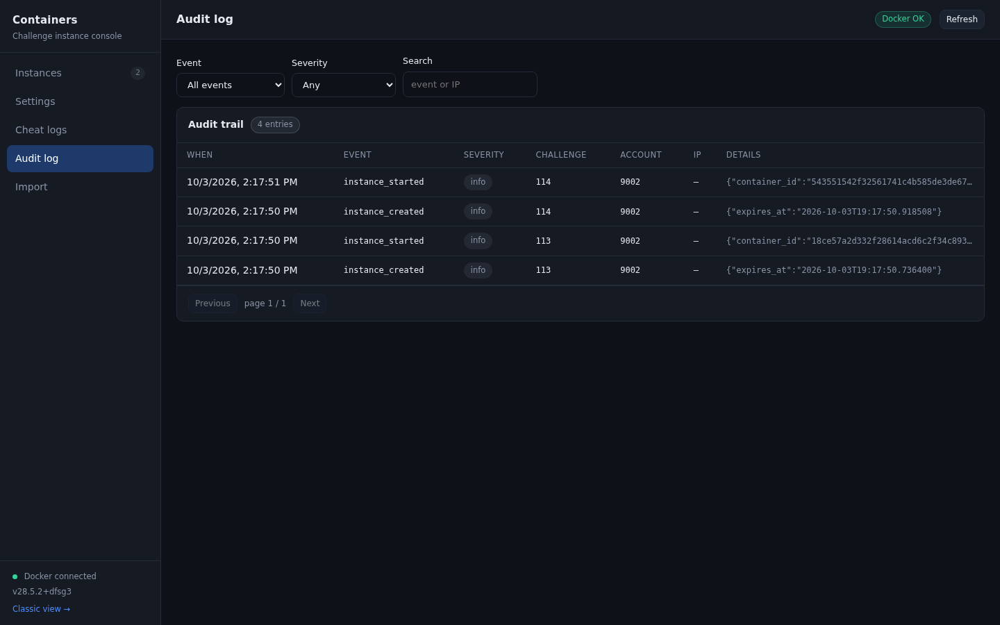
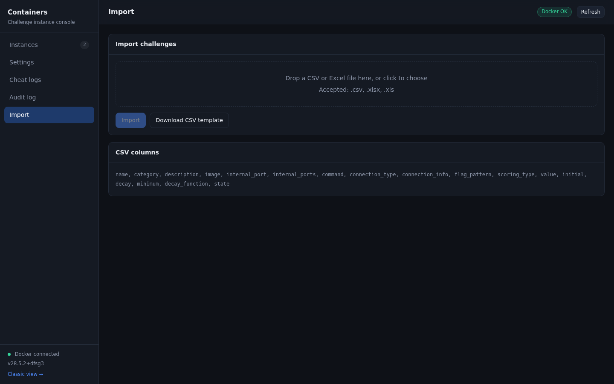
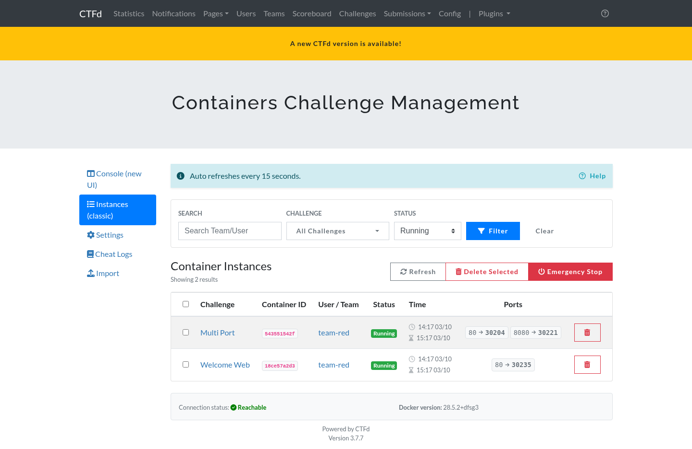
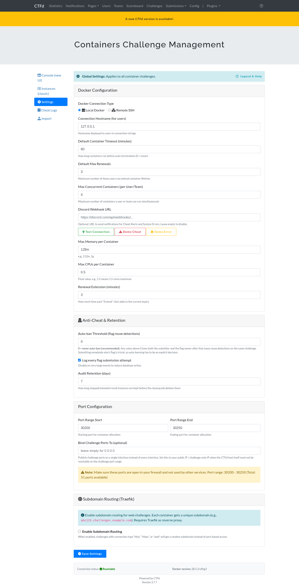
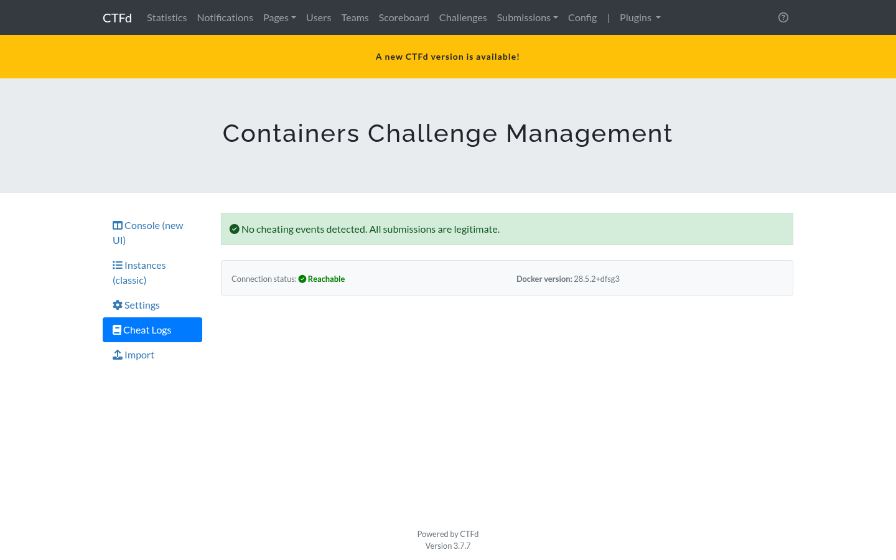
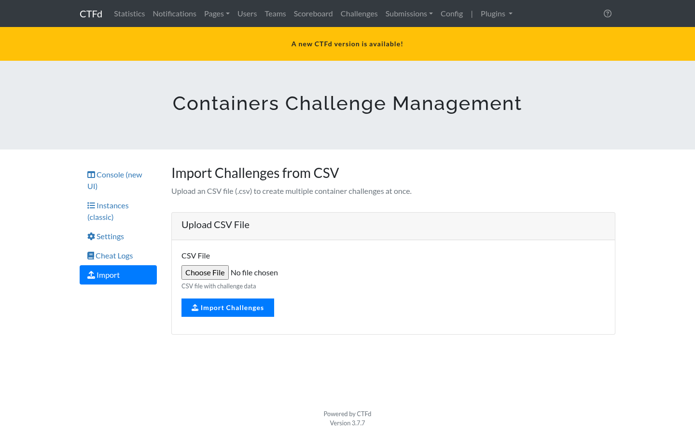

# Admin console

The console lives at **Admin, Containers, Console**, or directly at `/admin/containers/app`.

It is a standalone page. It does not use the CTFd admin theme or Bootstrap, so its look is independent of whichever theme the CTF is running. It uses the admin session for authentication, which means only administrators can open it.

The older Bootstrap pages are still available under **Instances (classic)**, **Settings**, **Cheat Logs**, and **Import** in the same menu. They show the same data and remain as a fallback.

## Sidebar

The sidebar shows the sections, a live Docker status indicator, the Docker version, and a link to the classic view.

If the Docker indicator is red, the plugin cannot reach the daemon. Open the Settings tab and check the connection.

## Instances tab

### Summary cards

| Card | Meaning |
| --- | --- |
| Running | Instances with a live container |
| Provisioning | Instances the plugin is still starting |
| Solved | Instances where the player submitted the correct flag |
| Error | Instances whose container failed to start or failed to stop |
| Total | All instance rows in the database |
| Free ports | Ports still available in the configured range |

A low **Free ports** number is the earliest warning that the port range needs to grow. Ports are released when an instance stops.

### Filters

- **Status**: running, provisioning, solved, stopped, or error, or all.
- **Challenge ID**: restrict to one challenge.
- **Limit**: how many rows to load.

### Table columns

| Column | Notes |
| --- | --- |
| Challenge | Links to the challenge in the admin panel |
| Account | Team id in team mode, user id in user mode |
| Status | Coloured badge, see the lifecycle table below |
| Container | First 12 characters of the Docker container id |
| Ports | The primary published port |
| Expires | Remaining time and the local expiry time |
| Renewals | How many extensions the account has used |

### Row actions

- **Logs** opens the last 500 lines of container output in a modal.
- **Stop** stops the container and keeps the instance record with status `stopped`.
- **Delete** stops the container and removes the instance row and its dependent rows. It asks for confirmation first.

### Bulk actions

Select rows with the checkboxes, then use **Delete selected**. **Emergency stop** stops every running container at once and keeps the records so you can see what was running.

Every destructive action asks for confirmation in an inline dialog. No browser dialog is used.

### Maintenance

| Button | Effect |
| --- | --- |
| Clean expired | Runs the expiry sweep immediately instead of waiting for the next scheduled pass |
| Prune old records | Deletes stopped, solved, and errored instance records older than the retention setting, and removes containers that no longer have a row |
| Delete solved records | Removes every instance row with status `solved` |

### Docker panel

Shows the socket in use, the daemon version, the number of running and total containers, and the number of images.

## Settings tab

Every plugin setting, grouped by purpose. The full reference is in [configuration.md](configuration.md).

The **Test connection**, **Demo cheat alert**, and **Demo error alert** buttons send a message to the webhook URL currently typed in the field, so you can validate it before saving.

## Cheat logs tab

Lists every detected flag reuse: when it happened, on which challenge, who submitted it, who owned the flag, and the source IP.

The table is paginated. Account names are resolved in bulk, so the page stays fast even with a long history.

## Audit log tab

The audit trail records what the plugin did, not just what players did. It is the place to look when something behaved unexpectedly.

Filter by event type, severity, or search event names and IP addresses.

| Event type | Written when |
| --- | --- |
| `instance_created` | The database row is created, before Docker is contacted |
| `instance_started` | The container is running and its ports are known |
| `instance_renewed` | A player extends the expiry |
| `instance_stopped_manual` | A player clicks Terminate |
| `instance_stopped_expired` | The timer ran out |
| `instance_stopped_solved` | The flag was correct |
| `instance_stopped_admin` | An admin stopped it |
| `instance_stopped_admin_delete` | Deleted from the console |
| `instance_stopped_admin_bulk_delete` | Removed by a bulk delete |
| `instance_stopped_emergency_stop` | Removed by Emergency stop |
| `instance_stopped_challenge_deleted` | The challenge itself was deleted |
| `flag_submitted_correct` | A flag was accepted |
| `flag_reuse_detected` | Another account's flag was submitted |

Severity is `info`, `warning`, `error`, or `critical`. Reuse detections are `warning` when nothing was banned and `critical` when the auto-ban threshold triggered.

The `details` column holds the event specific payload as JSON, for example the container id, the port mapping, or the flag owner account.

Instance rows are deleted after the retention period, and API keys are never included in the audit payload.

## Import tab

A drag and drop area for a CSV or Excel file, a button to download the CSV template, and a per-row report after the import. See [import.md](import.md).

## Instance lifecycle

| Status | Meaning |
| --- | --- |
| `pending` | Row created, provisioning not started |
| `provisioning` | Docker is being asked to start the container |
| `running` | Container is up, connection details are recorded |
| `stopping` | A stop is in progress |
| `stopped` | Container stopped, or it expired |
| `solved` | The player submitted the correct flag |
| `error` | Provisioning or stopping failed, details are in the record |

## API endpoints used by the console

All of them require an admin session and the CSRF token.

| Method | Path | Purpose |
| --- | --- | --- |
| GET | `/admin/containers/api/stats` | Counts per status and free ports |
| GET | `/admin/containers/api/instances` | List instances with filters |
| DELETE | `/admin/containers/api/instances/<id>` | Delete one instance |
| POST | `/admin/containers/api/instances/<id>/stop` | Stop one instance |
| GET | `/admin/containers/api/instances/<id>/logs` | Container output |
| POST | `/admin/containers/api/bulk-delete` | Delete several instances |
| POST | `/admin/containers/api/bulk/emergency-stop` | Stop everything |
| POST | `/admin/containers/api/bulk/cleanup-solved` | Delete solved rows |
| GET | `/admin/containers/api/cheats/page` | Paginated reuse detections |
| GET | `/admin/containers/api/audit` | Paginated audit trail |
| GET, POST | `/admin/containers/api/config` | Read or write settings |
| POST | `/admin/containers/api/cleanup/expired` | Run the expiry sweep |
| POST | `/admin/containers/api/cleanup/old` | Run the retention job |
| GET | `/admin/containers/api/images` | Images present on the host |
| GET | `/admin/containers/api/docker/health` | Connection check |
| POST | `/admin/containers/api/notifications/test` | Webhook test |
| POST | `/admin/containers/api/import` | CSV or Excel import |
| GET | `/admin/containers/download-template` | CSV template |

Note for anyone writing an integration: CTFd only validates the `CSRF-Token` header on requests that declare `Content-Type: application/json`. A POST with no body must still send that content type, otherwise the request is treated as a form submission and rejected with 403.

## Classic pages

The original Bootstrap pages are kept for compatibility and for anyone who prefers them.

