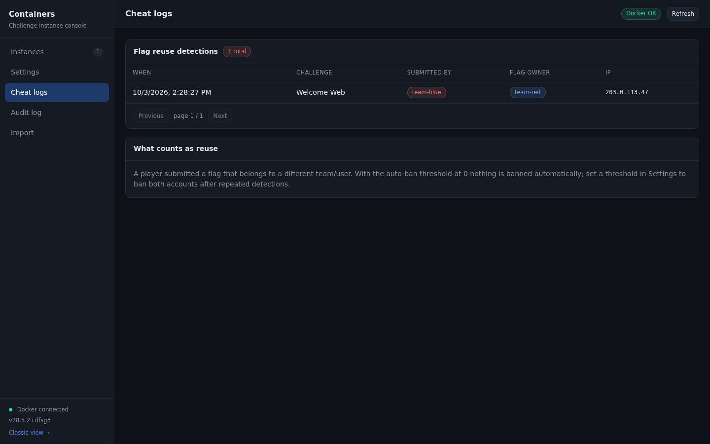
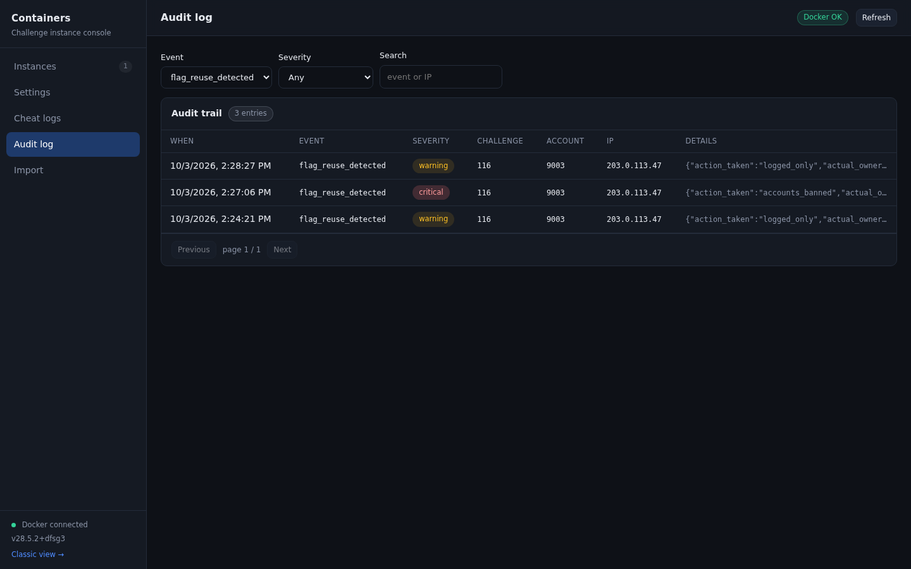
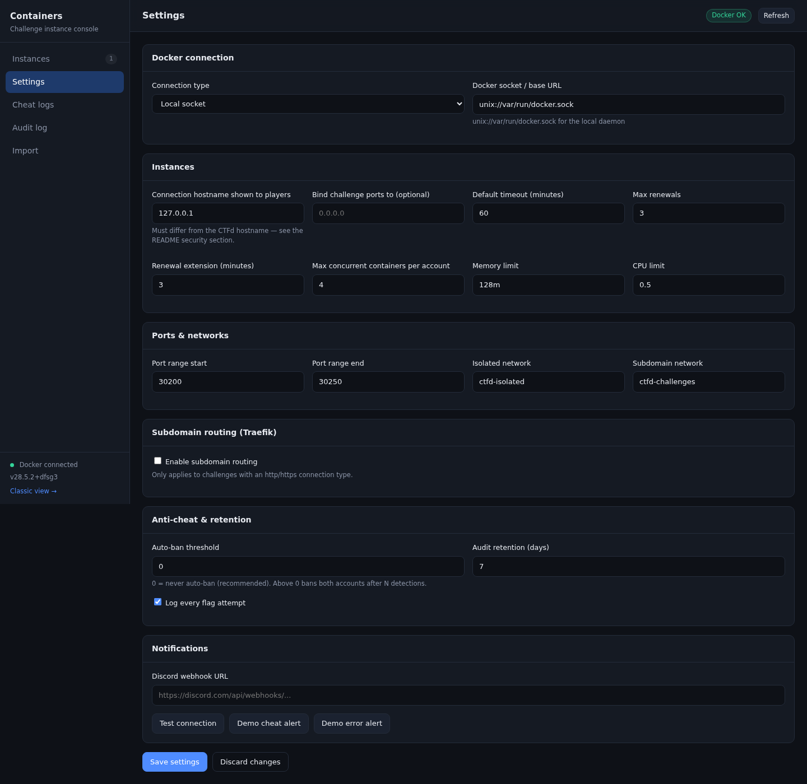
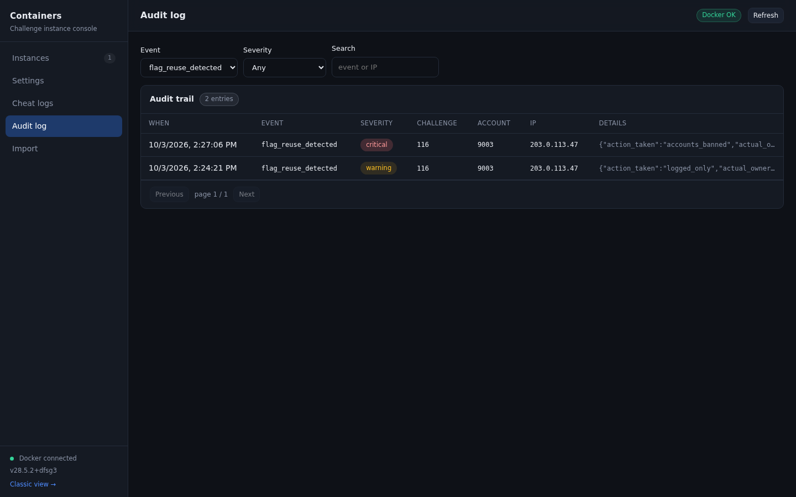
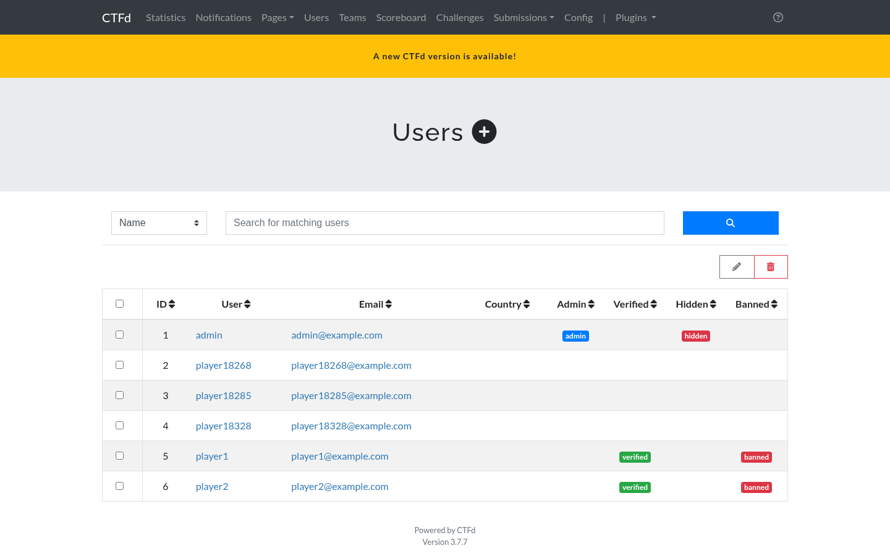
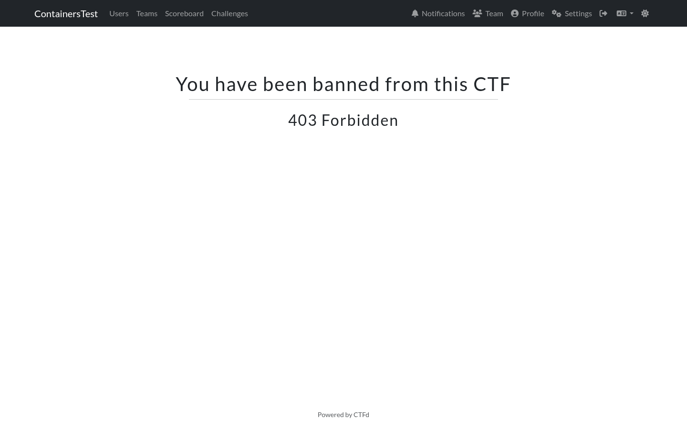

# Anti-cheat

The plugin watches for one specific kind of cheating: a player submitting a flag that belongs to a different account. Because every account gets its own flag, this is a reliable signal that flags are being shared.

## How detection works

Each generated flag is stored with:

- The challenge it belongs to.
- The account it was issued to.
- A status of `temporary`, `submitted_correct`, or `invalidated`.

When a flag is submitted on a challenge, the plugin looks up its hash scoped to **that challenge**. Three outcomes are possible:

| Outcome | Condition | Response to the player |
| --- | --- | --- |
| Correct | The flag belongs to this account | The solve is recorded |
| Expired | The flag exists but its container already expired | `This flag has expired` |
| Reuse | The flag belongs to a different account | `Incorrect` |

A reuse is never announced to the player. Telling them would reveal that the system detected it and would help them work out which flag was whose.

## What gets recorded

Every submission is written to `container_flag_attempts`, unless logging is turned off. Each row holds the challenge, the submitting account, the submitting user, the hashed submitted flag, the result, the source IP, the user agent, and a timestamp.

Reuse detections also write an audit entry with the event type `flag_reuse_detected`, severity `warning` or `critical`, and the flag owner's account id in the details.

## Where admins see it

**Console, Cheat logs** lists every detection, paginated, with account names resolved. The classic **Cheat Logs** page shows the same data.

The console Instances tab shows the total count on the cheat card, and the audit tab shows the same events in chronological order next to everything else the plugin did.

## The two outcomes

A detection ends in one of two states. Both are visible in the audit trail, and the `action_taken` field in the details column tells you which one happened.

### Case 1: logged only, nobody banned

This is the default. The auto-ban threshold is 0, so the plugin records the event, writes the audit entry, sends the Discord alert if configured, and takes no action against either account.

Filter the audit trail by the event `flag_reuse_detected`:

| Field | Value |
| --- | --- |
| Severity | `warning` |
| `action_taken` | `logged_only` |
| `actual_owner_account_id` | The account whose flag was taken |
| `ip_address` | Where the submission came from |

The threshold that produced this outcome is the one on the Settings tab:

Both accounts keep playing normally. Use the cheat log to talk to them, remove points, or ban them by hand according to your own rules.

### Case 2: both accounts banned

With the threshold set to 1 or more, reaching the threshold bans both the submitting account and the flag owner.

| Field | Value |
| --- | --- |
| Severity | `critical` |
| `action_taken` | `accounts_banned` |

The ban is a normal CTFd ban, so it shows up wherever CTFd shows bans. In the admin user list:

And the banned player sees this on their next request:

Bans are applied to every member of both teams in team mode, and to both user accounts in user mode. CTFd does not record a reason alongside the ban, so the audit entry for the event is the record of why it happened. Keep [operations.md](operations.md) retention in mind if you need that history for longer than the retention window.

To undo a ban, clear the banned flag on the affected users and teams in the CTFd admin panel.

## Discord alerts

If a webhook URL is configured, each detection sends an embed with the challenge, the two account ids, and whether anything was banned. Use **Demo cheat alert** on the Settings tab to preview the format without generating a real event.

## Auto-ban, and why it is off by default

There is a setting called **Auto-ban threshold**. It counts detections of the same challenge by the same account. When the count reaches the threshold, both the submitting account and the flag owner are banned.

The default is **0**, which means never ban. The reasoning:

- Submitting another account's flag is trivial. An attacker who obtains one valid flag can deliberately submit it to get the flag's owner banned.
- Banning is destructive and hard to reverse during a live event.
- Detection and logging are enough to investigate after the fact.

If you do enable it, set the threshold to more than 1. A threshold of 1 bans on the first detection, which is exactly the case an attacker can trigger on purpose. A threshold of 3 or more requires a repeated pattern.

When a ban triggers, both accounts are banned: the submitting account and the owner of the flag. The flag owner may be a collaborator, so both sides are treated the same way.

## Flags and cheating: what the plugin does not do

- It does not rate limit flag submissions. CTFd already has a global limit on incorrect submissions per minute, and it applies here.
- It does not detect a player solving a challenge without using the container, for example by finding the flag another way. Every flag is only valid for the account it was issued to, which covers the common case.
- It does not invalidate the owner's flag when a reuse is detected. The legitimate owner can still solve the challenge normally.

## Flag hygiene

Generated flags use a keyed HMAC for lookups and Fernet encryption at rest, so a database dump does not expose flags in a directly usable form. The encryption key lives in `container_config` in the same database, so this raises the effort rather than making the flags cryptographically unrecoverable from a full dump.

The random part of a flag uses an alphabet that excludes visually ambiguous characters. A player copying a flag by hand from a terminal will not confuse a zero with the letter O.

## Reducing write volume

On a large event, `container_flag_attempts` grows with every submission. Set **Log every flag attempt** to off to record only reuse detections. The audit trail still records correct solves, so you lose the brute force history but keep the cheat history.

The plugin also prunes the oldest attempts on a six hour schedule, keeping the table bounded.
