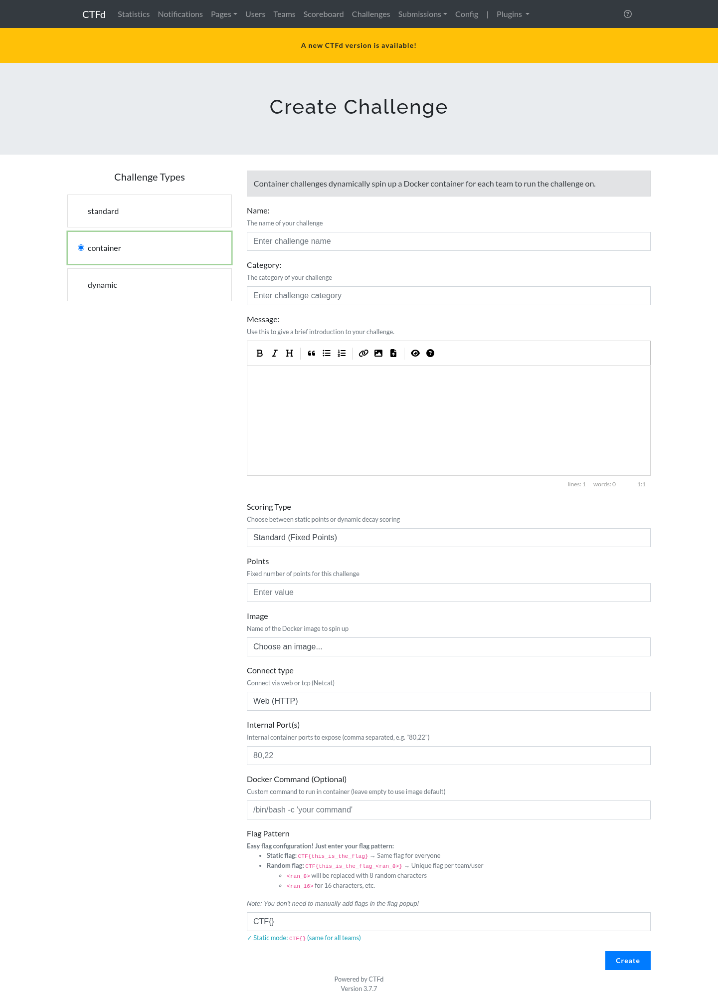
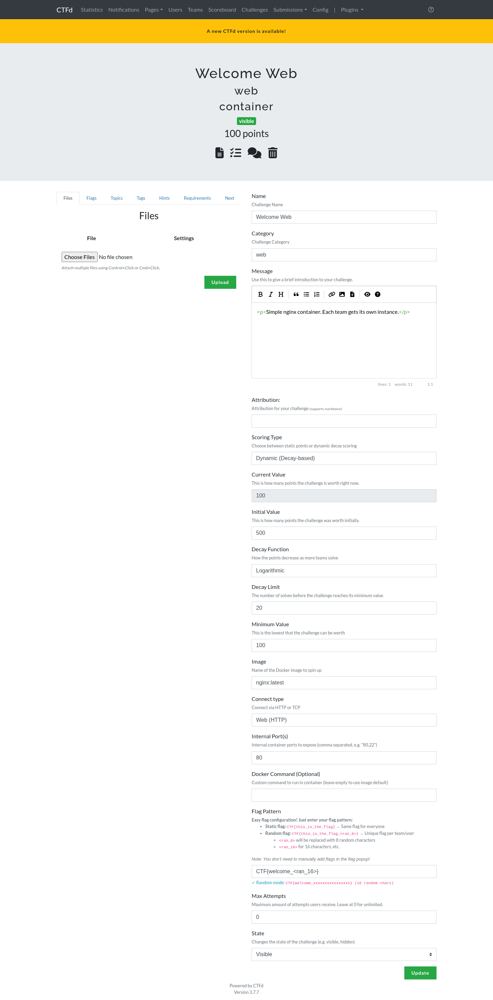
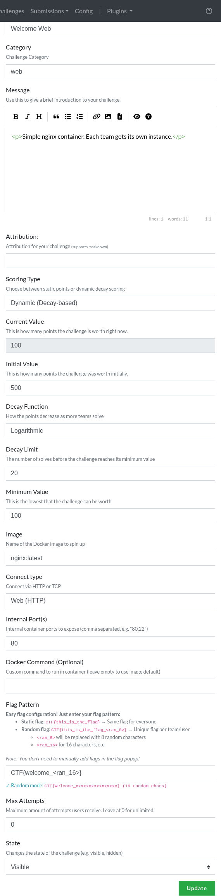

# Creating a container challenge

A container challenge looks like any other CTFd challenge to a player, except that it has a **Fetch Instance** button instead of static connection text.

## Create the challenge

1. Go to **Admin, Challenges, Create Challenge**.
2. Pick the **container** type from the challenge type list. The form reloads with the container fields.
3. Fill in name, category, and description as usual.
4. Fill in the container fields described below.
5. Click **Create**.



## Container fields

### Image

The dropdown lists images that already exist on the Docker host. The plugin queries the Docker daemon for them, so an image has to be pulled on the host before it can be selected.

To make images available:

```sh
docker pull nginx:latest
docker pull ubuntu:20.04
```

If you type an image name through the API or a CSV import that is not present locally, the plugin tries to pull it before starting the container and reports a clear error if the pull fails.

### Connect type

| Value | What the player sees |
| --- | --- |
| `http` | One clickable link per mapped port |
| `tcp` or `nc` | `nc <host> <port>` per mapped port |
| `ssh` | `ssh -p <port> user@<host>` per mapped port |
| `https` | A link using `https://` |
| anything else | `<host>:<port>` pairs |

This value only changes how the connection details are rendered. It does not change how the container is started.

### Internal ports

A comma separated list, for example `80` or `80,8080`. Each entry is published on its own host port from the configured port range. The first entry is treated as the primary port, which matters for subdomain routing.

Duplicate entries are removed, and a value outside the range 1 to 65535 is rejected. The old single `internal_port` column is kept in sync automatically with the first entry.

### Docker command

Optional. Overrides the image's default command. The placeholder `{FLAG}` is replaced with the generated flag, which is useful for images that expect the flag as an argument:

```
/bin/sh -c "echo {FLAG} > /flag && exec nginx -g 'daemon off;'"
```

The flag is also always available in the `FLAG` environment variable.

## Flag configuration

The form takes one human friendly field, the **Flag Pattern**, and derives the rest.

| Pattern | Mode | Result |
| --- | --- | --- |
| `CTF{static_flag}` | static | The same flag for every account |
| `CTF{prefix_<ran_16>_suffix}` | random | A unique flag per account |
| `CTF{<ran_8>}` | random | 8 random characters between the braces |

The `<ran_N>` token is replaced with N random characters. The alphabet excludes characters that are easy to confuse when copying by hand: `0`, `O`, `1`, `l`, and `I`. Lengths below 8 are raised to 8, because a shorter random part is guessable.

The live preview under the field shows what the flag will look like, and whether the mode is static or random.

Generated flags are:

- Stored encrypted in the database, using Fernet with a key generated on first use.
- Hashed with a keyed HMAC for lookups, so the stored digest cannot be attacked with a precomputed table if the database leaks.
- Scoped to the challenge, so a flag from one challenge never validates on another one.
- Invalidated when the container expires without being solved.

If the challenge uses a static flag, every account shares it and no per instance record is created.

## Scoring

### Standard

A fixed number of points. Enter the value in the **Points** field.

### Dynamic

Points decay as more accounts solve the challenge.

| Field | Meaning |
| --- | --- |
| Initial value | Points before anyone solves it |
| Decay function | `linear` or `logarithmic` |
| Decay | For linear, points removed per solve. For logarithmic, the number of solves needed to reach the minimum. |
| Minimum value | The floor. The value never drops below this. |

Linear:

```
value = initial - (decay * solve_count)
```

Logarithmic, which is the CTFd parabolic curve:

```
value = ((minimum - initial) / decay^2) * solve_count^2 + initial
```

The value is rounded up and clamped to the minimum. Only challenges with a decay greater than zero are recalculated, so standard challenges are unaffected.

## Updating a challenge

Open the challenge in the admin panel. The container fields appear in the editor. Saving validates the same way as creation:

- A non numeric port or internal port is rejected.
- An empty field leaves the previous value in place, which matches CTFd's own behaviour for other challenge types.
- The placeholder flag row is recreated if it is missing.



The container fields sit in the right column of the challenge editor:



## Deleting a challenge

Deleting a challenge stops its running containers first, then removes the challenge, its instances, their flags, and their audit rows. Without this step containers would keep running with no database row left to manage them.

## Resource limits

Memory, CPU, and the process limit are global settings that apply to every container. They are configured on the Settings tab, not per challenge.

Each container also gets:

- All Linux capabilities dropped, with `CHOWN`, `SETUID`, and `SETGID` added back because many images need them at startup.
- `no-new-privileges` set, so a setuid binary inside the container cannot raise its privileges.
- A PID limit that blocks fork bombs.

The container still runs as root inside its own namespace. That is deliberate: many CTF challenges require the player to obtain root inside the container, and that is the point of the challenge.

## Naming

Containers are named `<challenge>-<id>_<account>`, for example `welcome-web-42_9002`. The challenge id is included so two challenges with the same name cannot collide. All containers carry these labels:

| Label | Value |
| --- | --- |
| `ctfd.managed` | `true` |
| `ctfd.plugin` | `containers` |
| `ctfd.instance_uuid` | The instance identifier |
| `ctfd.challenge_id` | Challenge id |
| `ctfd.account_id` | Team or user id |
| `ctfd.expires_at` | Unix timestamp of expiry |

These labels are what let the plugin find and clean up its own containers:

```sh
docker ps -a --filter label=ctfd.managed=true
```
