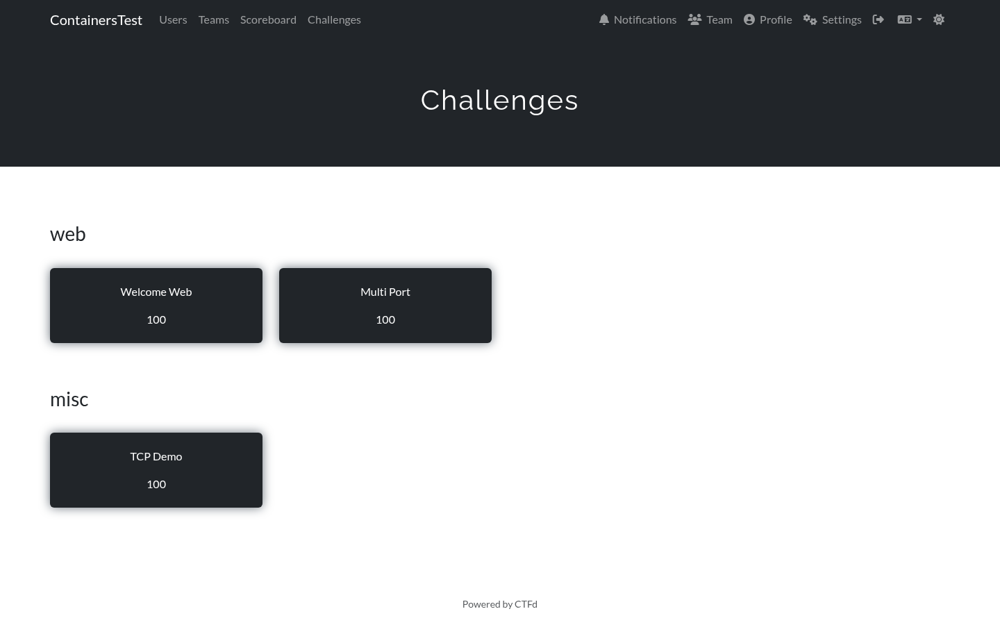
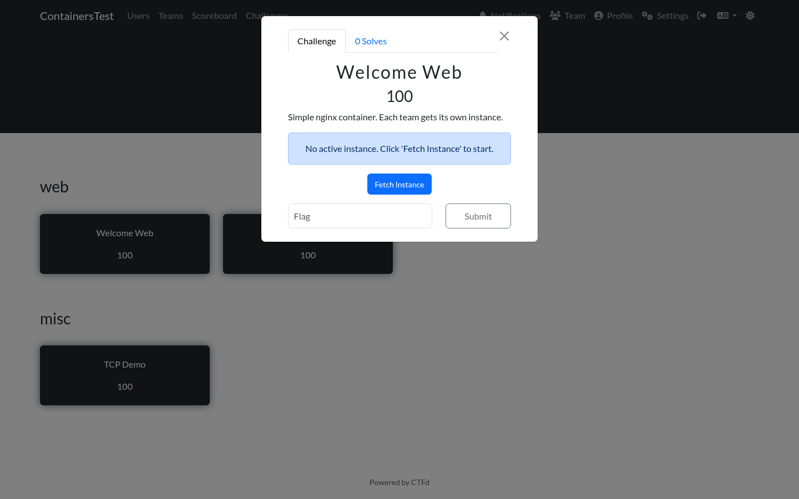
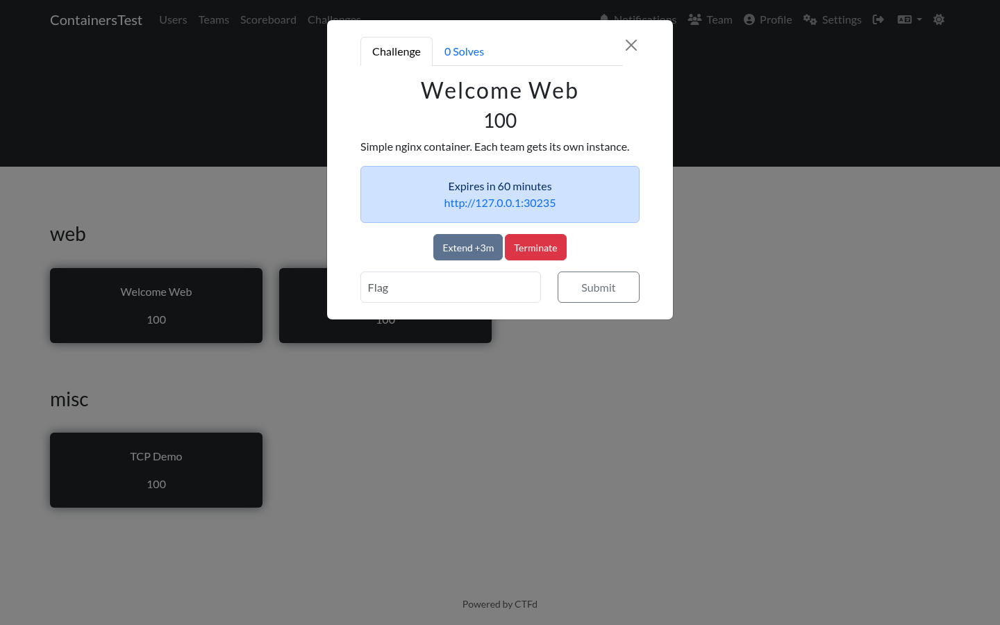
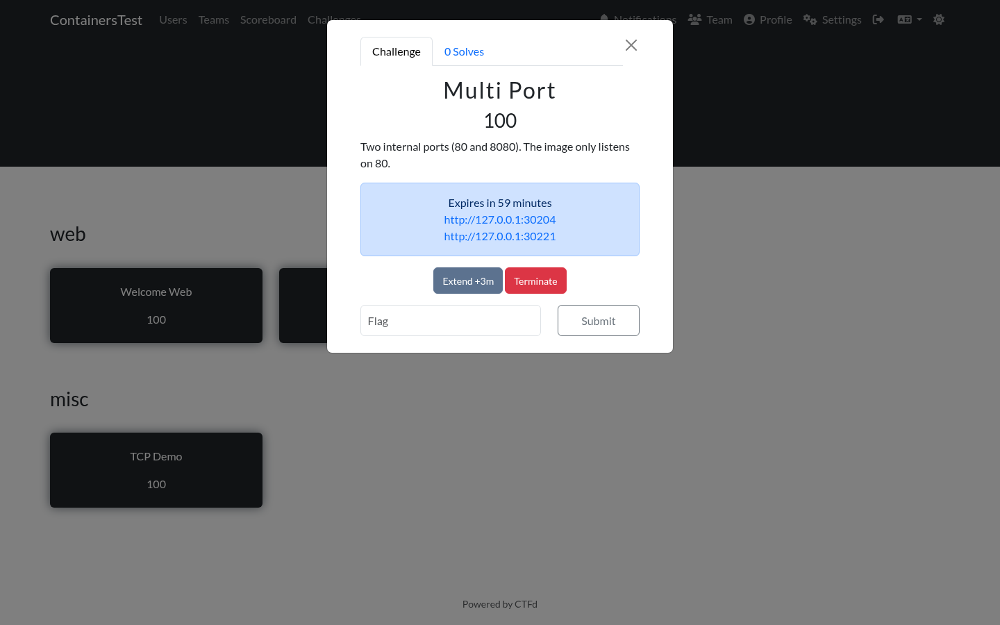
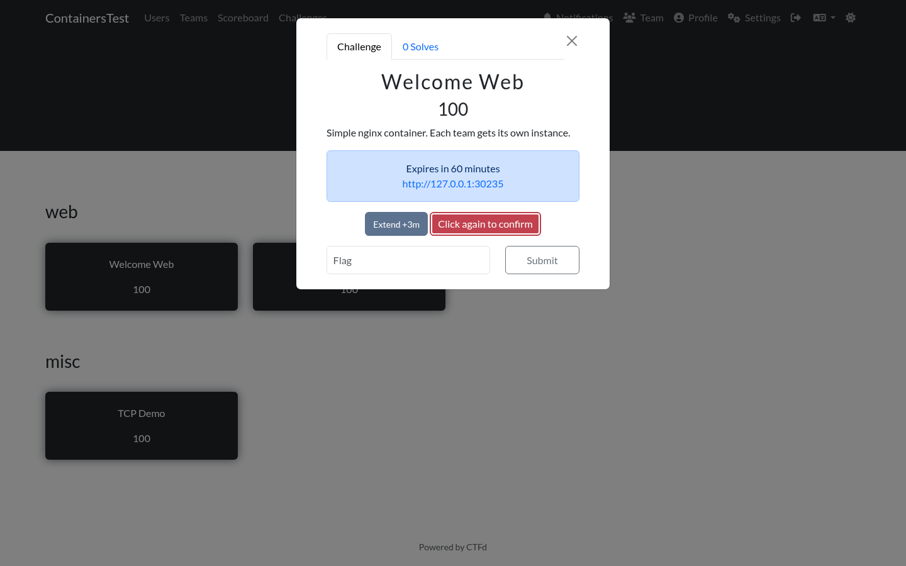

# Player guide

This is what a player sees. No knowledge of Docker is required.

## The challenge list

Container challenges appear in the normal CTFd challenge list, grouped by category like any other challenge.

## Before fetching an instance

Open a challenge and the panel shows a single message. Nothing has been started yet, and no resources are being used.

## Fetching an instance

Click **Fetch Instance**. The plugin starts a container for your team from the challenge image and gives it a unique flag. After a few seconds the panel shows:

- How long the instance has left before it is removed.
- One link or connection string per exposed port.
- Any extra connection notes the organizer added.
- An **Extend** button.
- A **Terminate** button.

For a web challenge, click the link to open the challenge in a new tab. For a TCP challenge, the panel shows a command you can paste into a terminal, for example `nc challenges.example.com 30245`.

If the challenge exposes more than one port, the panel lists each one:

Only one instance exists per account per challenge. Clicking **Fetch Instance** again returns the running instance instead of starting a second one.

## Extending the time

Click **Extend** to add time. The amount added per click is set by the organizer, 5 minutes by default. The button label shows the current value, for example **Extend +5m**.

Each account has a limited number of extensions, 3 by default. The instance page shows how many have been used. Once the limit is reached, **Extend** returns an error and you have to let the instance expire or terminate it.

The new expiry is calculated from the existing expiry, so extending never shortens the remaining time.

## Terminating early

Click **Terminate** to stop your instance before it expires. The button asks for confirmation once, to avoid an accidental click:

Click the button a second time to confirm. If you do nothing for 5 seconds, the confirmation is cancelled and the button returns to its normal state. No browser dialog is involved.

Terminating releases the container and the resources it was using. You can fetch a new instance afterwards, but the previous flag is no longer valid, and a new one is generated.

## Solving the challenge

Submit the flag in the usual flag box and click **Submit**.

When the flag is correct, the plugin stops your container immediately. There is no reason to keep it running after the challenge is solved, and the resources go back to the pool. You will not be able to start another instance for that challenge afterwards, because you have already solved it.

## When the time runs out

The container is removed automatically when the timer reaches zero. If the challenge tab is open, the panel updates within a few seconds and shows that no instance is active. You can fetch a new one, which starts a fresh container with a new flag.

The plugin removes the container at the exact expiry time when Redis keyspace notifications are configured, and within about 30 seconds otherwise.

## Limits

Three things can stop you from fetching an instance:

| Message | Meaning |
| --- | --- |
| You have reached the maximum number of concurrent containers | You already run the maximum number of instances across all challenges. Terminate one, or wait for one to expire. |
| You must be on a team to access this feature | The CTF runs in team mode and you have not joined a team. |
| No available ports in range | The host has no free ports left. This is an infrastructure problem, so tell the organizers. |

## What happens if you leave the page

Nothing. The container keeps running and keeps its timer. It is tracked on the server, not in your browser. You can close the tab and come back later.

## Notes for organizers writing challenge descriptions

The panel already shows the connection details, so the challenge description does not need to repeat them. A short line about what the challenge is (covering only the part a player needs) is enough.
